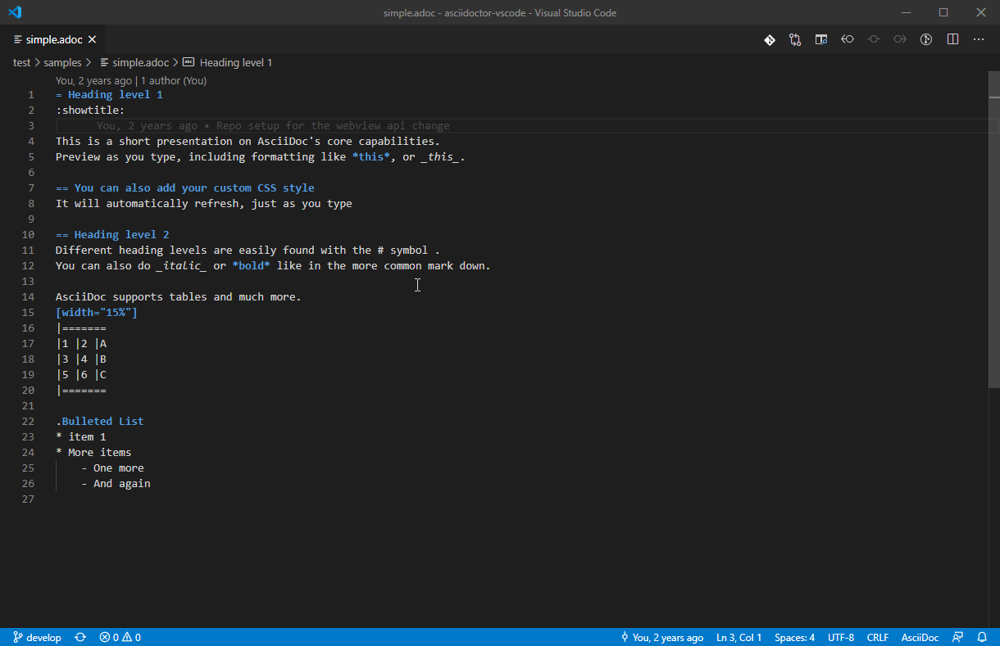

# AsciiDoc support for Visual Studio Code

[](https://marketplace.visualstudio.com/items?itemName=joaompinto.asciidoctor-vscode)
[](https://marketplace.visualstudio.com/items?itemName=joaompinto.asciidoctor-vscode)
[](https://vsmarketplacebadge.apphb.com/rating/joaompinto.asciidoctor-vscode.svg)

An extension that provides live preview, syntax highlighting and snippets for the AsciiDoc format using Asciidoctor flavor.



## Contents

1. [How to Install](##how-to-install)
2. [How to Use](##how-to-use)
    1. [Preview](###preview)
    2. [Export as PDF](###export-as-pdf)
    3. [Snippets](###snippets)
3. [Options](##options)
4. [How to Build and Install from Source (Linux and Mac)](##how-to-build-and-install-from-source-(linux-and-mac))
    1. [Manual](###manual)
    2. [Script](###script)
5. [Contributing](##contributing)
6. [Credits](##credits)

## How to Install

Launch VS Code Quick Open (Ctrl+P), paste the following command, and press enter:

`ext install joaompinto.asciidoctor-vscode`

Alternatively you can use the built-in extension browser to find the _AsciiDoc_ by _joaompinto_ extension and install it.

## How to Use

The extension activates automatically when opening an AsciiDoc file (.adoc, ad, .asc, .asciidoc).

### Preview

To show the preview you can use the same commands as the Markdown extension:

* Toggle Preview - `ctrl+shift+v` (Mac: `cmd+shift+v`)
* Open Preview to the Side - `ctrl+k v` (Mac: `cmd+k v`)

The preview refreshes automatically, but it can also be forced with the _AsciiDoc: Refresh Preview_ command.

By default the preview style follows the VSCode theme (`workbench.colorTheme`). To use Asciidoctor's style set option `asciidoc.preview.useEditorStyle` to `false`.<br/>
(See more details under [Options](##options))

### Export as PDF

The extension provides a quick command to export your AsciiDoc file as PDF.

* Open the command palette - `ctrl+shift+p` or `F1` (Mac: `cmd+shift+p`)
* Select _AsciiDoc: Export document as PDF_
* Choose the folder and filename for the generated PDF

By default a separate binary is downloaded and used to render the document in PDF format. To use Asciidoctor PDF set option `asciidoc.use_asciidoctorpdf` to `true`.<br/>
(See more details under [Options](##options))

### Snippets

Several code snippets are provided including but not limited to: include statements, images, links, header, headings, lists, blocks, etc...

For a full list open the command palette and select _Insert Snippet_.

## Options

This extension is controlled by a multitude of options.

The following list contains all the options and their default value.

| Option: Default value | Description |
| :--- | :--- |
| `asciidoc.asciidoctor_command: "asciidoctor"` | The path or command invoked when using Asciidcotor for the preview. |
| `asciidoc.asciidoctorpdf_command: "asciidoctor-pdf"` | The path or command invoked when using Asciidcotor PDF for the _Export ad PDF_ function. |
| `asciidoc.forceUnixStyleSeparator: true` | Force set the file separator style to unix style. If set false, separator style will follow the system style. |
| `asciidoc.preview.breaks: false` | Sets how line-breaks are rendered in the AsciiDoc preview. Setting it to 'true' creates a `<br>` for every newline. |
| `asciidoc.preview.doubleClickToSwitchToEditor: true` | Double click in the AsciiDoc preview to switch to the editor. |
| `asciidoc.preview.fontFamily: "-apple-system, BlinkMacSystemFont, 'Segoe WPC', 'Segoe UI', 'HelveticaNeue-Light', 'Ubuntu', 'Droid Sans', sans-serif"` | Controls the font family used in the AsciiDoc preview. |
| `asciidoc.preview.fontSize: 14` | Controls the font size in pixels used in the AsciiDoc preview. |
| `asciidoc.preview.lineHeight: 1.6` | Controls the line height used in the AsciiDoc preview. This number is relative to the font size. |
| `asciidoc.preview.linkify: true` | Enable or disable conversion of URL-like text to links in the AsciiDoc preview. |
| `asciidoc.preview.markEditorSelection: true` | Mark the current editor selection in the AsciiDoc preview. |
| `asciidoc.preview.openAsciiDocLinks: "inPreview"` | How should clicking on links to AsciiDoc files be handled in the preview.<br/>"inPreview" Try to open links in the the AsciiDoc preview<br/>"inEditor" Try to open links in the the editor |
| `asciidoc.preview.scrollEditorWithPreview: true` | When an AsciiDoc preview is scrolled, update the view of the editor. |
| `asciidoc.preview.scrollPreviewWithEditor: true` | When an AsciiDoc editor is scrolled, update the view of the preview. |
| `asciidoc.preview.scrollPreviewWithEditorSelection: true` | [Deprecated] Scrolls the AsciiDoc preview to reveal the currently selected line from the editor.<br/>This setting has been replaced by 'asciidoc.preview.scrollPreviewWithEditor' and no longer has any effect. |
| `asciidoc.preview.useEditorStyle: true` | Use editor style instead of default ascidoctor.css |
| `asciidoc.previewFrontMatter: "hide"` | Sets how YAML front matter should be rendered in the AsciiDoc preview. "hide" removes the front matter. Otherwise, the front matter is treated as AsciiDoc content. |
| `asciidoc.styles: []` | [Deprecated] A list of URLs or local paths to CSS style sheets to use for the AsciiDoc preview. Relative paths are interpreted relative to the folder open in the explorer. If there is no open folder, they are interpreted relative to the location of the AsciiDoc file. All "\" need to be written as "\\". |
| `asciidoc.trace: "off"` | Enable debug logging for the AsciiDoc extension. |
| `asciidoc.use_asciidoctor_js: true` | Use Asciidoctor.js instead of the 'asciidoctor_command' to render the preview. |
| `asciidoc.use_asciidoctorpdf: false` | Use Asciidoctor PDF instead of the integrated renderer for the _Export as PDF_ command. |

## How to Build and Install from Source (Linux and Mac)

### Manual

```shell
git clone https://github.com/asciidoctor/asciidoctor-vscode
cd asciidoctor-vscode
npm install
sudo npm install -g vsce typescript
vsce package
code --install-extension *.vsix
```

### Script

```sh
git clone https://github.com/asciidoctor/asciidoctor-vscode
bash ./script/build.sh build install
```

## Contributing

To contribute simply clone the repository and then commit your changes. When you do a pull requests please clearly highlight what you changed in the pull comment.

Do not update the extension version, changelog or readme, it will be done by the maintainers.

## Credits

* [AsciiDoc](http://asciidoc.org/) by Stuart Rackham
* [Asciidoctor](https://asciidoctor.org/) organization for the the language flavor
* [Asciidoctor.js](https://asciidoctor.org/docs/asciidoctor.js/) for the preview
* [Asciidoctor PDF](https://asciidoctor.org/docs/asciidoctor-pdf/) for the _Export to PDF_ function
* [wkhtmltopdf](https://wkhtmltopdf.org/) for the _Export to PDF_ function

All the following people who have contributed to the extension:

* Bart Sokol
* Daniel Mulholland
* Garrett D'Amore
* Gigacee
* Jackson C. Wiebe
* João Pinto
* Kevin Palmowski
* Marcelo Alvim
* Mark Roszko
* Masanori Asano
* Matteo Campinoti
* Stephen Pegoraro
* Tatsunori Uchino
* chriskoerner
* ojn
* sgn
* Øyvind Hansen
